# Displacement collision exploit spots

## Out Of Bounds spots
|Map|Image|setpos|Notes|Found by|
|--|--|--|--|--|
|**cp_gravelpit**|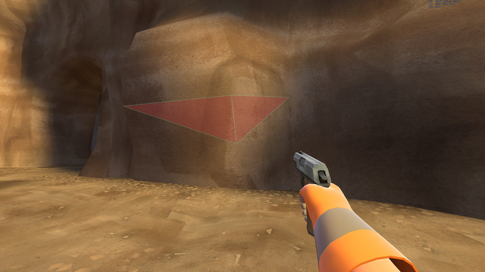|setpos 107.639053 1867.525635 -539.961975;setang -3.309386 107.040245 0.000000|From dispenser, forward near 0|**Jessica**|
|**koth_nucleus**|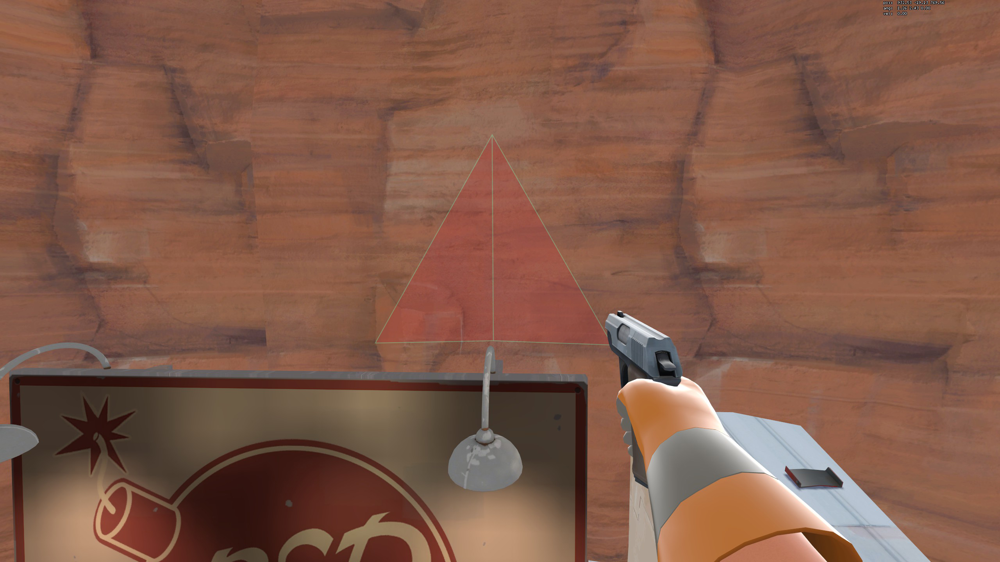|setpos 932.533447 -19.126015 769.563416;setang 1.264689 2.434120 0.000000|From any building, works symmetricaly on both sides of the map|**Jessica**, **BUTA**, **Murman**|
|**sd_doomsday**|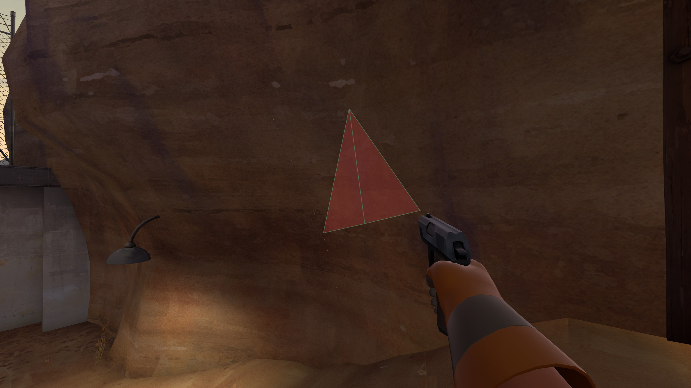|setpos -383.843628 745.968750 78.305435;setang -0.495080 -49.499229 0.000000|From sentry/dispenser + standing player|**BUTA**|
|**pl_cashworks**|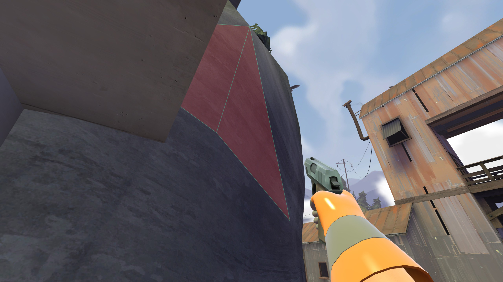|setpos -137.314056 -2695.944336 248.031311;setang -41.084988 -37.205318 0.000000|From sentry + standing player. Lifting player should stand as close to the displacement as possible. Engineer should not stick to the wall on the left. In order to fully pass thru you should be speedboosted either by "Disciplinary Action" (simple but requires another player) or runboost tecnhique (hard)|**umfc**, **T.A.G.**|
|**cp_yukon_final**|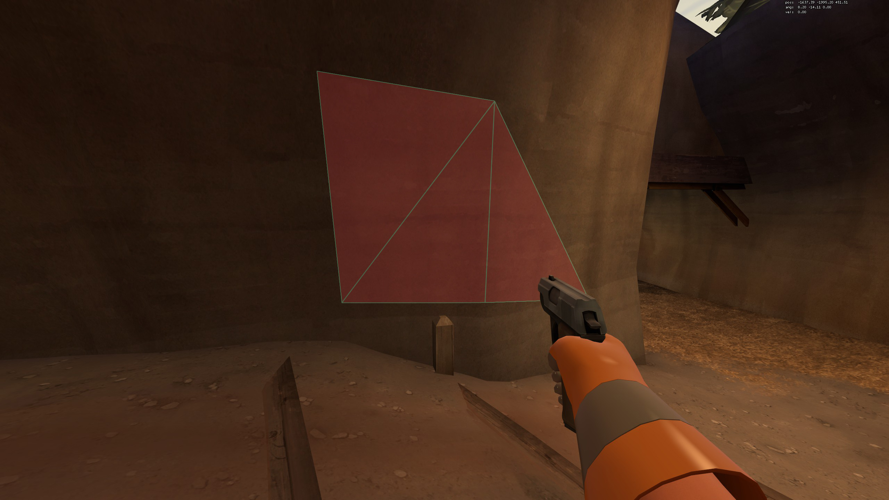|setpos -1637.388672 -1995.198242 451.511963;setang 8.200434 -14.107269 0.000000|Red side, from dispenser|**umfc**|
|**cp_yukon_final**|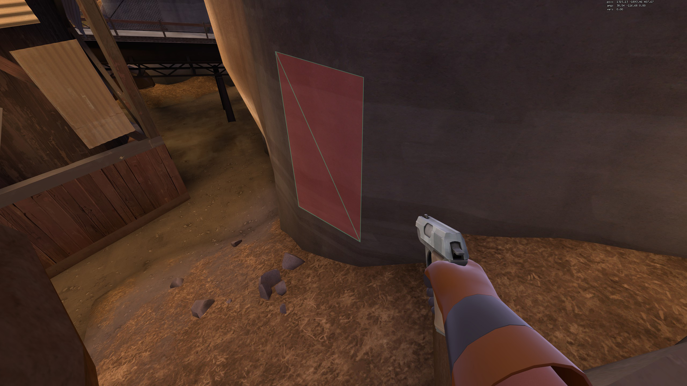|setpos 1315.133789 -1893.462280 407.667358;setang 38.544960 -116.679756 0.000000|Red side, from dispenser (near rocks)|**Murman**|
|**cp_yukon_final**|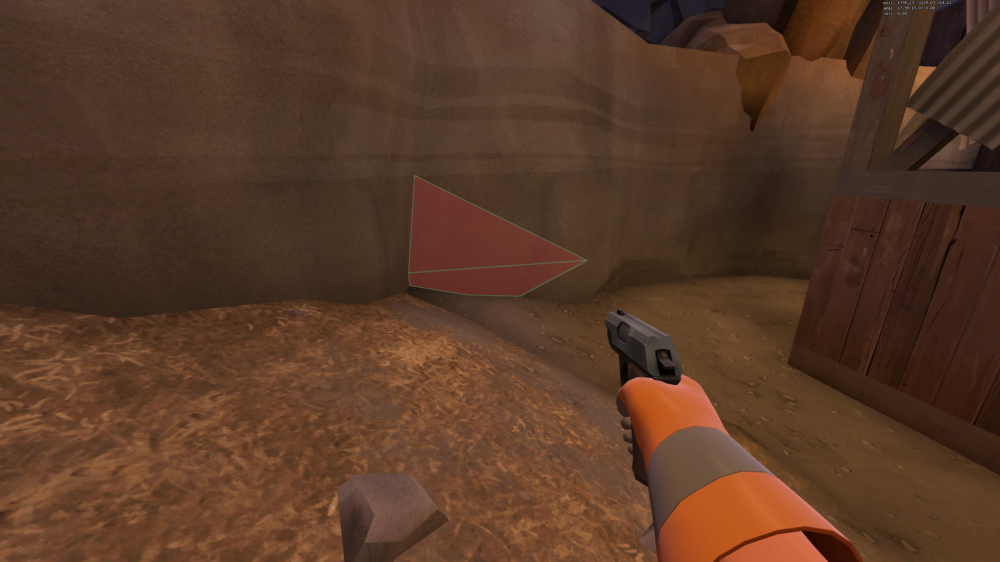|setpos 1334.228027 -2129.033203 214.116730;setang 17.994774 15.067128 0.000000|Red side. Slide from ground. Y around -2048, pitch = 26.3; yaw = 19.6, strafe to push further and build tp exit|**Banana Boi**, **Coronel**|
|**pl_frontier_final**|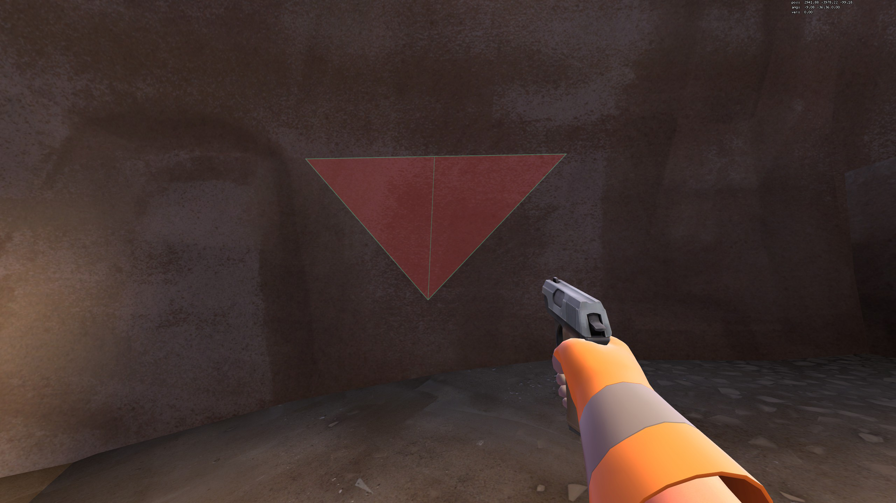|setpos 2941.884766 -3978.215332 -99.176613;setang -9.075032 -36.360134 0.000000|h -37.N; -49 < yaw < -48.5, dispenser close placement|**No.10884**, **umfc**, **BUTA**, **Micák**|
|**pl_borneo**|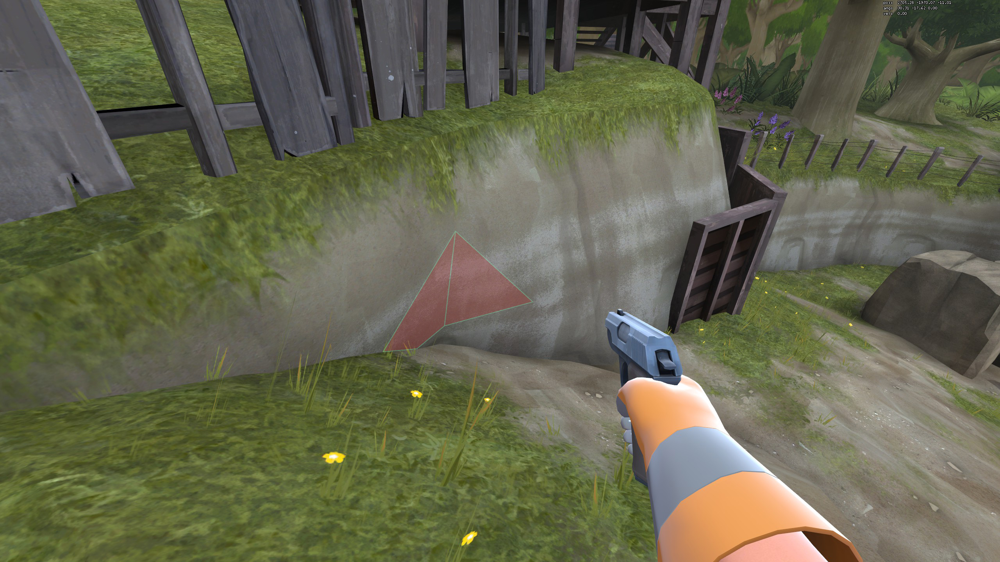|setpos 2705.280273 -1970.074341 -11.013588;setang 30.305202 -17.624945 0.000000|Ground slide|**Banana Boi**, **Coronel**|
|**tc_hydro**|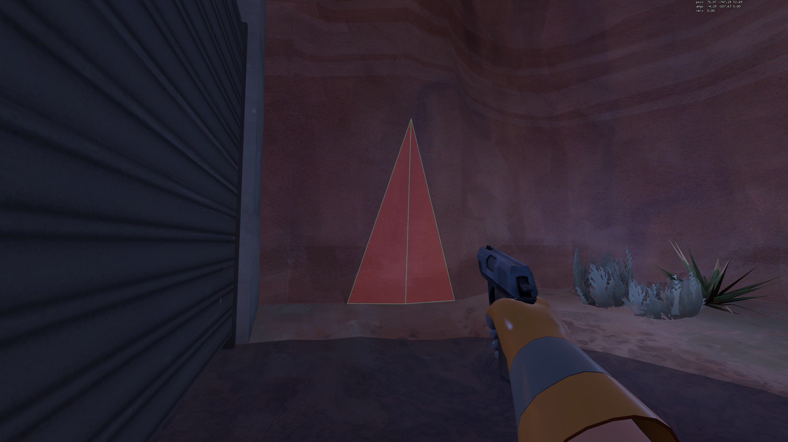|setpos 71.968750 -747.294617 52.688168;setang -4.292808 -107.633263 0.000000|From sentry. h 109.5; yaw -106.3|**Banana Boi**|
|**koth_suijin**|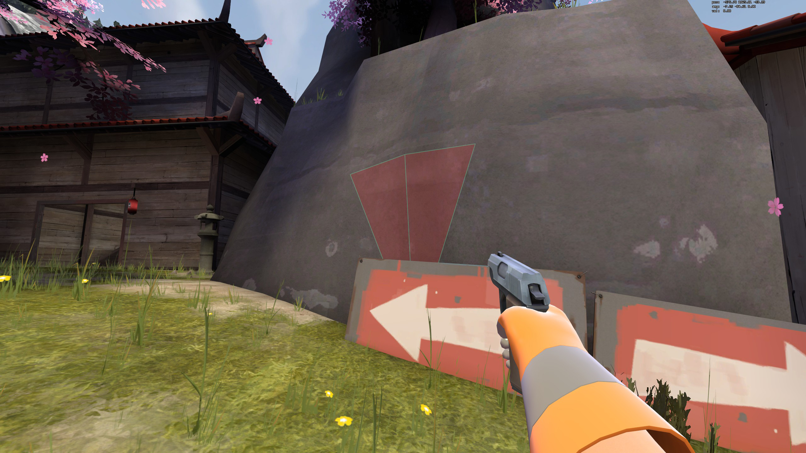|setpos -575.700378 1865.008667 -59.394608;setang -7.249805 -84.610390 0.000000|From dispenser next to the sign. X around -510, strafe to push further. Passing through is hard, but at least you can completely hide inside and build dispenser + sentry|**Azure**|

## Fixed spots
These are the spots that used to be exploitable, but eventually got fixed by covering them with clip-brushes.
|Map|Image|setpos|Notes|Found by|
|--|--|--|--|--|
|**pl_enclosure_final**|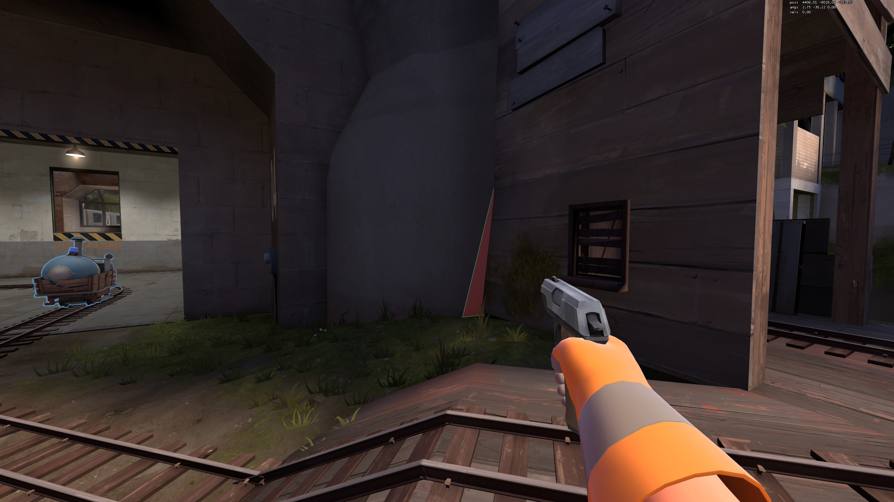|setpos 4406.513672 -8028.038086 -187.968689;setang 2.749974 -30.215014 0.000000|From ground|**Jessica**, **BUTA**, **Slender**|
|**cp_lavapit_final**|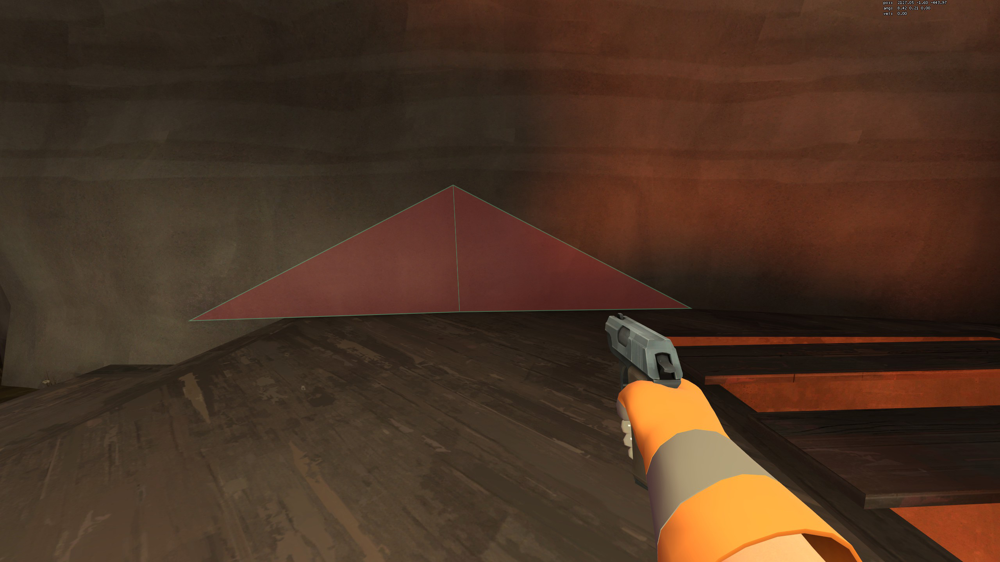|setpos 2127.047607 -1.599238 -443.968689;setang 8.415008 0.214628 0.000000|From ground|**Coronel**|

## Halfway-stuck spots
These are the spots that you can use for hiding, but where you can't freely move or build anything.
|Map|Image|setpos|Notes|Found by|
|--|--|--|--|--|
|**cp_dustbowl**|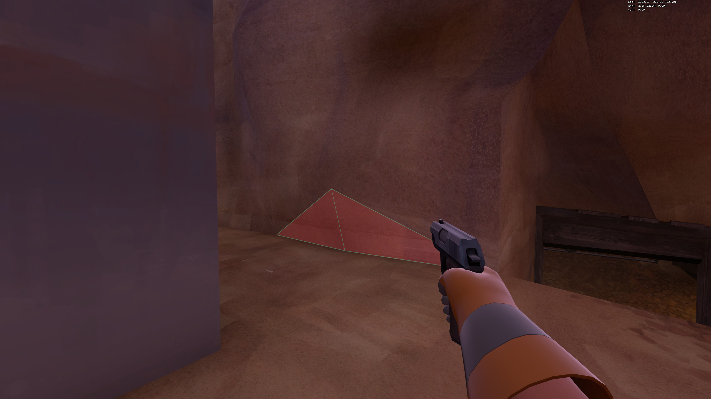|setpos 1963.573730 -221.901550 -127.013893;setang 2.584925 129.442276 0.000000|Second stage, from ground|*unknown*|
|**plr_nightfall_final**||setpos -171.122482 12945.343750 -294.090363;setang 2.309962 -67.083206 0.000000|From dispenser/sentry|**The Nubing**|
|**cp_lavapit_final**|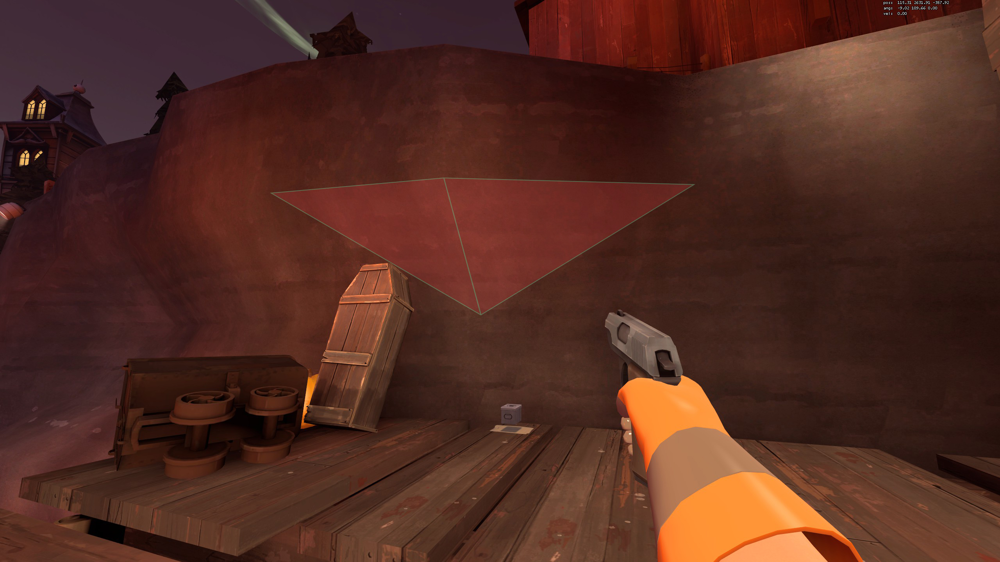|setpos 115.313744 2631.914063 -387.921997;setang -9.020029 109.664581 0.000000|From dispenser/sentry|**umfc**|

## Not confirmed
tc_hydro (around -660 100), vsh_nucleus (from roof near sign), cp_gravelpit (point B)