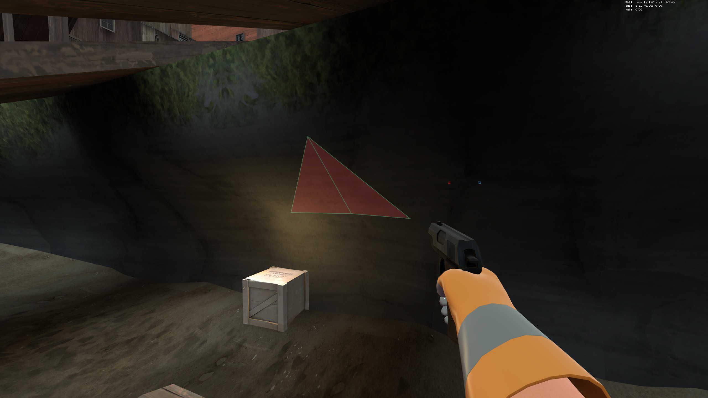

# Displacement collision exploit spots

## Out Of Bounds
|Map|Image|setpos|Notes|Found by|
|--|--|--|--|--|
|**cp_dustbowl**||setpos 1963.573730 -221.901550 -127.013893;setang 2.584925 129.442276 0.000000|Second stage, from ground|*unknown*|
|**cp_gravelpit**||setpos 107.639053 1867.525635 -539.961975;setang -3.309386 107.040245 0.000000|From dispenser, forward near 0|**Jessica**|
|**koth_nucleus**||setpos 932.533447 -19.126015 769.563416;setang 1.264689 2.434120 0.000000|From any building, works symmetricaly on both sides of the map|**Jessica**, **BUTA**, **Murman**|
|**sd_doomsday**||setpos -383.843628 745.968750 78.305435;setang -0.495080 -49.499229 0.000000|From sentry/dispenser + standing player|**BUTA**|
|**cp_yukon_final**||setpos -1637.388672 -1995.198242 451.511963;setang 8.200434 -14.107269 0.000000|Red side, from dispenser|**umfc**|
|**cp_yukon_final**||setpos 1315.133789 -1893.462280 407.667358;setang 38.544960 -116.679756 0.000000|Red side, from dispenser (near rocks)|**Murman**|
|**pl_frontier_final**||setpos 2941.884766 -3978.215332 -99.176613;setang -9.075032 -36.360134 0.000000|h -37.N; -49 < yaw < -48.5, dispenser close placement|**No.10884**, **umfc**, **BUTA**, **Micák**|
|**pl_borneo**||setpos 2705.280273 -1970.074341 -11.013588;setang 30.305202 -17.624945 0.000000|Ground slide|**Coronel**, **Banana Boi**|

## Fixed OOB's
|Map|Image|setpos|Notes|Found by|
|--|--|--|--|--|
|**pl_enclosure_final**||setpos 4406.513672 -8028.038086 -187.968689;setang 2.749974 -30.215014 0.000000|From ground|**Jessica**, **BUTA**, **Slender**|
|**cp_lavapit_final**||setpos 2127.047607 -1.599238 -443.968689;setang 8.415008 0.214628 0.000000|From ground|**Coronel**|

## Halfway-stuck spots
|Map|Image|setpos|Notes|Found by|
|--|--|--|--|--|
|**plr_nightfall_final**||setpos -171.122482 12945.343750 -294.090363;setang 2.309962 -67.083206 0.000000|From dispenser/sentry|**The Nubing**|
|**cp_lavapit_final**||setpos 115.313744 2631.914063 -387.921997;setang -9.020029 109.664581 0.000000|From dispenser/sentry|**umfc**|

## Not confirmed
tc_hydro, vsh_nucleus